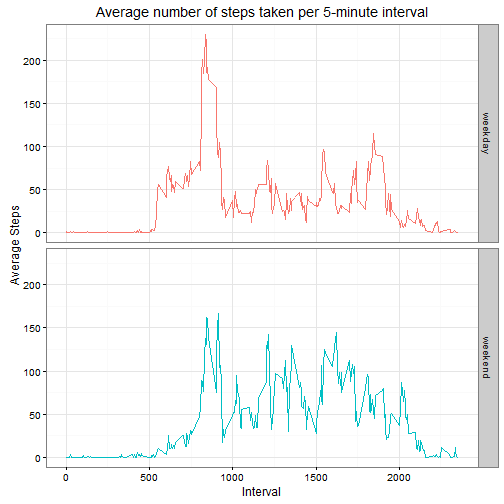

Reproducible Research : Project 1
=================================


###Introduction
This assignment makes use of data from a personal activity monitoring device. This device collects data at 5 minute intervals through out the day. The data consists of two months of data from an anonymous individual collected during the months of October and November, 2012 and include the number of steps taken in 5 minute intervals each day.

###Loading and preprocessing the data
Show any code that is needed to

1. Load the data (i.e. read.csv())
2. Process/transform the data (if necessary) into a format suitable for your analysis

```r
#Load the required libraries
library(ggplot2)
#Read the data from the unzipped file in the working directory and format it
all_data = read.csv(file = "data/activity.csv")
all_data$date = as.Date(all_data$date)
```

###What is mean total number of steps taken per day?

For this part of the assignment, you can ignore the missing values in the dataset.

1. Calculate the total number of steps taken per day
2. If you do not understand the difference between a histogram and a barplot, research the difference between them. Make a histogram of the total number of steps taken each day
3. Calculate and report the mean and median of the total number of steps taken per day

```r
#Create a histogram for the total steps taken each day
aggStepsperDay = aggregate(steps~date,all_data,sum)
hist(aggStepsperDay$steps, xlab = "Total steps", main = "Total Steps taken each day")
```


```r
#Calculate and report the mean and median of the total number of steps taken per day
mean_a = round(mean(aggStepsperDay$steps))
cat("Mean of total No. of steps per day: ",mean_a)
```

```
## Mean of total No. of steps per day:  10766
```

```r
med_a = median(aggStepsperDay$steps)
cat("Median of total No. of steps per day: ",med_a)
```

```
## Median of total No. of steps per day:  10765
```

###What is the average daily activity pattern?

Make a time series plot (i.e. type = "l") of the 5-minute interval (x-axis) and the average number of steps taken, averaged across all days (y-axis)
Which 5-minute interval, on average across all the days in the dataset, contains the maximum number of steps?

```r
#Make a time series plot of the 5-minute interval (x-axis) and the average number of steps taken, averaged across all days (y-axis)
avgStepsperInterval = round(aggregate(steps~interval,all_data,mean),0)
g1 = ggplot(avgStepsperInterval,aes(interval,steps))
g1 + geom_line(lwd=1) + theme_bw() + labs(x="5-minute interval", y = "Average steps per day", title = "Average Daily Activity Pattern")
```


```r
#Identify the interval (avg. aross all days) which contains the maximum number of steps
i = which.max(avgStepsperInterval$steps)
int = avgStepsperInterval[i,]$interval
st = avgStepsperInterval[i,]$st
cat("The Interval that, on average across all the days in the dataset, contains the maximum number of", st, " steps is ", int)
```

```
## The Interval that, on average across all the days in the dataset, contains the maximum number of 206  steps is  835
```

###Imputing missing values

Note that there are a number of days/intervals where there are missing values (coded as NA). The presence of missing days may introduce bias into some calculations or summaries of the data.

1. Calculate and report the total number of missing values in the dataset (i.e. the total number of rows with NAs)
2. Devise a strategy for filling in all of the missing values in the dataset. The strategy does not need to be sophisticated. For example, you could use the mean/median for that day, or the mean for that 5-minute interval, etc.
3. Create a new dataset that is equal to the original dataset but with the missing data filled in.
4. Make a histogram of the total number of steps taken each day and Calculate and report the mean and median total number of steps taken per day. Do these values differ from the estimates from the first part of the assignment? What is the impact of imputing missing data on the estimates of the total daily number of steps?

```r
#Calculate and report the total number of rows with missing values in the dataset
s = sum(!complete.cases(all_data))
cat("Number of rows with missing values is ", s)
```

```
## Number of rows with missing values is  2304
```

```r
#Impute the NAs with the average value for the corresponding interval
imp_data = all_data
for (i in (1:nrow(all_data)))
         { if (is.na(all_data$steps[i]))
                 {
                        inter <- all_data$interval[i]
                        val <- avgStepsperInterval$steps[which(avgStepsperInterval$interval==inter)]
                        imp_data$steps[i] <- val
         }}

#Calculate the total steps taken each day with the Imputed values and create a histogram
impStepsperDay = aggregate(steps~date,imp_data,sum)
hist(impStepsperDay$steps, xlab = "Total steps", main = "Total Steps taken each day (Imputed)")
```


```r
#Calculate and report the mean and median of the total number of steps taken per day after Imputing
mean_b = round(mean(impStepsperDay$steps))
cat("Mean of total No. of steps per day(Imputed): ",mean_b)
```

```
## Mean of total No. of steps per day(Imputed):  10766
```

```r
med_b = median(impStepsperDay$steps)
cat("Median of total No. of steps per day(Imputed): ",med_b)
```

```
## Median of total No. of steps per day(Imputed):  10762
```

```r
##The Mean remains the same while the Median has marginally reduced by 3 points.
```

###Are there differences in activity patterns between weekdays and weekends?

For this part the weekdays() function may be of some help here. Use the dataset with the filled-in missing values for this part.

1. Create a new factor variable in the dataset with two levels - "weekday" and "weekend" indicating whether a given date is a weekday or weekend day.
2. Make a panel plot containing a time series plot (i.e. type = "l") of the 5-minute interval (x-axis) and the average number of steps taken, averaged across all weekday days or weekend days (y-axis). See the README file in the GitHub repository to see an example of what this plot should look like using simulated data.

```r
#Create a new factor variable in the dataset with two levels - "weekday" and "weekend" indicating whether a given date is a weekday or weekend day.
for (i in 1:nrow(imp_data))
{
        if (weekdays(imp_data$date[i]) == 'Saturday' || weekdays(imp_data$date[i]) == 'Sunday')
        {
                imp_data$daytype[i] = 'weekend'
        } else 
        {
                imp_data$daytype[i] = 'weekday'
        }
}
imp_data$daytype = as.factor(imp_data$daytype)

#Make a panel plot containing a time series plot (i.e. type = "l") of the 5-minute interval (x-axis) and the average number of steps taken, 
#averaged across all weekday days or weekend days (y-axis).
impStepsperInterval = aggregate(steps ~ interval + daytype,imp_data,mean)
impStepsperInterval$steps = round(impStepsperInterval$steps)
g = ggplot(impStepsperInterval,aes(interval,steps))
g + geom_line(aes(color=daytype)) + facet_grid(daytype~.) + theme_bw() + labs(x="Interval", y ="Average Steps", title="Average number of steps taken per 5-minute interval") + theme(legend.position='none')
```



